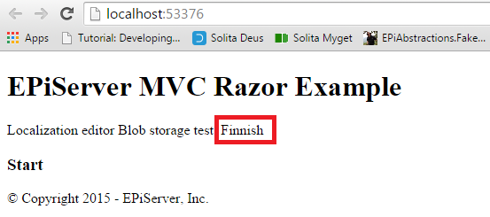

# Localization Editor

The purpose of LocalizationEditor is to supply UI for managing localizations in Episerver. Editor can be installed using Nuget: https://www.myget.org/feed/solita-episerver/package/nuget/Solita.LocalizationEditor.UI .

Defining Categorys/Localizations:

    ```C#
        public class Localizations
        {
			[LocalizationCategory("Common", 100)]
			public static class Common
			{
				[Localization(Description = "myCompany", DefaultValue = "myCompany")]
				public const string Sitename = "/common/sitename";
			}
		}
    ```
Localization categorys and strings are visible in the left handside in the editor:


The localizations values(listed in the table, in the image) are read from xml file, using MediaData(blobs) as data-access technology.

The localizations are retrieved in .cshtml files like this:
    
	```html
        <p>Localization editor Blob storage test: @Html.Translate("/common/languagemenufi")</p>
    ```

**Solita.LocalizationEditor.TestProject** Up&Running:(using translation /common/languagemenufi)



## Features
- Edit localizations
- Export localizations to CSV format
- Import localizations from CSV/XML format
- Set default values for localizations

## Migration from 1.0 -> 1.1
- Export localizations to csv file(use the export button)
- Update localizationEditor from nuget
- Import localizations from the exported csv -> Save
- Alternativelly you can import localizations from xml file(episerver localization file)

## How it works:
- Load all translation categorys and localizations to from assemblys loaded in app domain(classes decorated with *Category* attribute or fields decorated with *Localization* attribute)
    - Example of defining categorys/localizations: **Solita.LocalizationEditor.TestEpiProject\Localizations.cs**
    - Category is registered using attribute **[LocalizationCategory("category name", "<int>")]**, where <int> = order number
    - Localization is registered using attribute **[Localization(Description="xxx" DefaultValue = "xxx")]**
- Load the xml file that contains localizations, using given **FileAccessStrategy** implementation(defined in controller **LocalizationEditorController.cs**)
- Render the lcoalization values from xml to html table
- After localizations have been modified and **Save** functionality is called, a new xml file is created to blob storage

## Further development
- Build solution using configuration **DevDeploy**
    - DevDeploy configuration packages *Solita.LocalizationEditor.UI* project
    - Copies the required build artifacts to *Solita.LocalizationEditor.TestEpiProject* project
    - This way changes in the localizationEditor project are available immediatelly in the test project after build

# Tests
All unit tests should be green. Otherwise there is something wrong with core functionalities

## Build targets
Custom build targets are defined in **Solita.LocalizationEditor.UI.csproj** file(in the end). The custom build targets are activated only if "DevDeploy" configuration is selected

## Notice
When Episerver.Framework is updated to version >= 9, loading epi site will throw "NullReference" Exception if there is custom VPP-configurations defined in web.config

### Performance
UI is updated with JQuery at the moment, manipulating dom directly. When using large datasets for localizations, UI freezes when invoking functionalities like Revert, import, export, or set default values.
Replacing dom manipulation with databinding could be something to look at in the future releases(knockout or reactjs for example)
